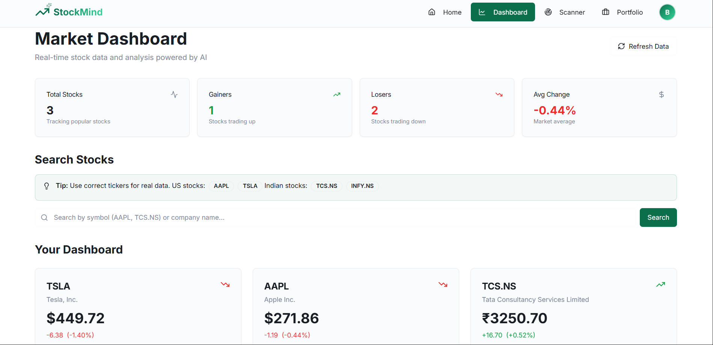
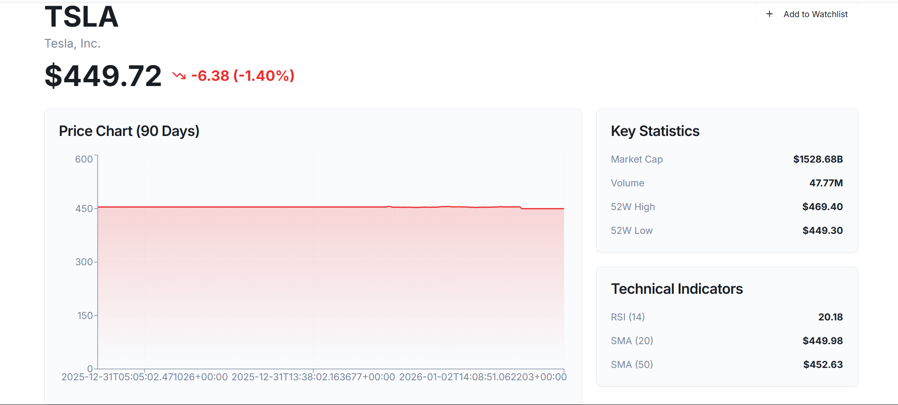
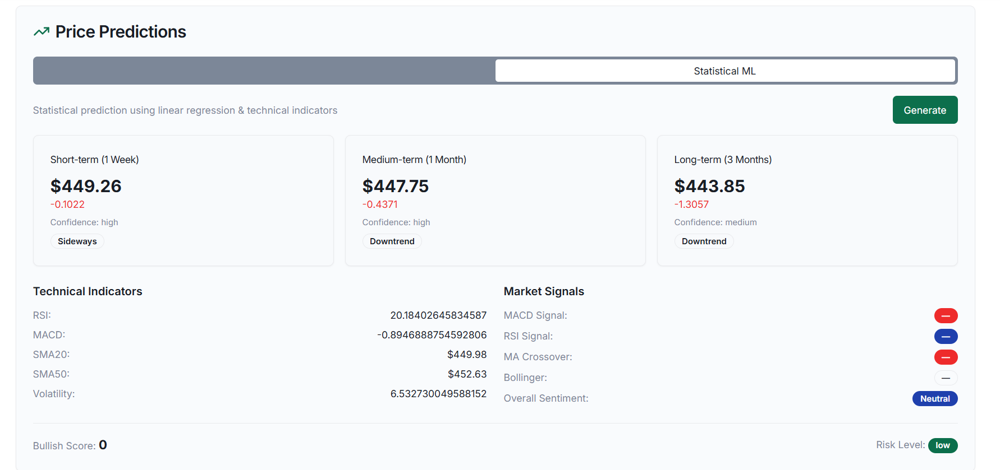
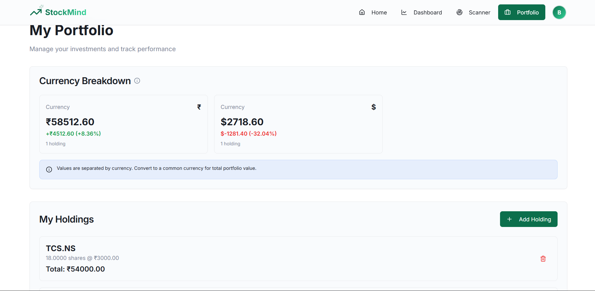
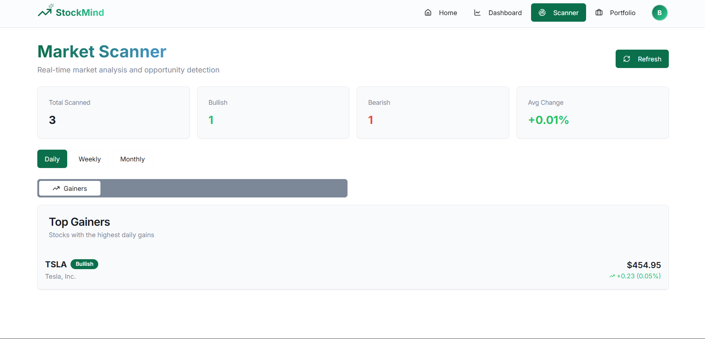

# 📈 StockMind - AI-Powered Stock Market Intelligence Platform

<div align="center">


**A comprehensive full-stack real-time stock market analysis platform featuring AI-powered predictions, technical indicators, news sentiment analysis, and intelligent portfolio management.**

[Features](#-key-features) • [Tech Stack](#-tech-stack) • [Architecture](#-architecture) • [Installation](#-installation) • [Usage](#-usage) • [API Docs](#-api-documentation) • [Contributing](#-contributing)

</div>

---

## 📸 Screenshots

<div align="center">

### Real-time Dashboard


### AI Predictions & Charts



### Portfolio Management


### Market Scanner


</div>

---

## 🌟 Key Features

### 📊 Real-Time Market Intelligence
- **Live Stock Prices**: WebSocket-based real-time price updates with sub-second latency
- **Multi-Currency Support**: Automatic detection for USD, INR, GBP, JPY, EUR
- **Technical Indicators**: RSI, MACD, Bollinger Bands, Moving Averages (SMA/EMA), Stochastic Oscillator
- **Advanced Charts**: Interactive charts with zoom, pan, and multiple timeframes
- **Market Scanner**: Discover top gainers, losers, breakouts, and unusual volume stocks
- **Timeframe Analysis**: Daily, weekly, and monthly market trends

### 🤖 AI-Powered Predictions
- **LSTM Neural Network**: Deep learning model for 7-day price forecasting
- **Statistical ML**: Multiple algorithms (ARIMA, Prophet) with confidence scores
- **Sentiment Analysis**: Google Gemini AI + TextBlob for news sentiment scoring
- **Risk Assessment**: Volatility-based risk ratings (Low/Medium/High/Extreme)
- **Confidence Intervals**: Upper and lower prediction bounds
- **Historical Accuracy**: Track prediction accuracy over time

### 📰 News & Sentiment Analysis
- **Real-Time News**: Integration with NewsAPI and yfinance news feeds
- **AI Sentiment Scoring**: Advanced NLP for bullish/bearish/neutral sentiment
- **India-Focused Coverage**: Special focus on NSE/BSE stocks
- **Auto-Refresh**: Background tasks update news every 10 minutes
- **Source Aggregation**: Multiple news sources for comprehensive coverage
- **Symbol Filtering**: Filter news by specific stocks

### 💼 Advanced Portfolio Management
- **Holdings Tracking**: Track investments with real-time P&L calculations
- **Multi-Currency Portfolios**: Separate tracking for different currencies
- **Performance Analytics**: ROI, profit/loss percentages, CAGR
- **Watchlist**: Monitor stocks with custom price alerts
- **Transaction History**: Complete audit trail of all trades
- **Tax Reporting**: Capital gains calculations (coming soon)

### 🔐 Security & Authentication
- **JWT Authentication**: Secure token-based authentication with refresh tokens
- **User Management**: Registration, login, profile management
- **CORS Protection**: Secure cross-origin requests
- **Rate Limiting**: API rate limiting middleware to prevent abuse
- **Password Encryption**: Bcrypt hashing for secure password storage
- **Session Management**: Automatic token refresh and logout

---

## 🚀 Tech Stack

### Backend Technologies
| Technology | Version | Purpose |
|------------|---------|---------|
| **Django** | 4.2.7 | Web framework & ORM |
| **Django REST Framework** | 3.14.0 | RESTful API development |
| **Daphne** | 4.0+ | ASGI server for WebSockets |
| **PostgreSQL** | 15+ | Primary database |
| **Redis** | 7.2+ | Caching & message broker |
| **Celery** | 5.3+ | Distributed task queue |
| **TensorFlow** | 2.15+ | Deep learning & LSTM models |
| **yfinance** | Latest | Stock market data |
| **NewsAPI** | - | Financial news aggregation |
| **Google Gemini** | Latest | AI sentiment analysis |

### Frontend Technologies
| Technology | Version | Purpose |
|------------|---------|---------|
| **React** | 18.3 | UI framework |
| **TypeScript** | 5.8 | Type safety |
| **Vite** | 5.4 | Build tool & dev server |
| **Tailwind CSS** | 3.4 | Utility-first CSS |
| **shadcn/ui** | Latest | Component library |
| **Recharts** | 2.15 | Data visualization |
| **Axios** | 1.6+ | HTTP client |
| **React Query** | 5.8+ | Server state management |
| **React Router** | 6.30 | Client-side routing |
| **Zod** | 3.25+ | Schema validation |

### DevOps & Tools
- **Docker** & **Docker Compose** - Containerization
- **Gunicorn** - WSGI HTTP server
- **Nginx** - Reverse proxy (production)
- **Prometheus** - Metrics & monitoring (configured)
- **Git** - Version control

---

## 🏗️ Architecture

### System Architecture Diagram

```
┌─────────────────────────────────────────────────────────────────┐
│                     Frontend Layer (React + TypeScript)          │
│  ┌──────────┐  ┌──────────┐  ┌──────────┐  ┌──────────┐       │
│  │Dashboard │  │Portfolio │  │  Scanner │  │  Detail  │       │
│  │  Page    │  │   Page   │  │   Page   │  │   Page   │       │
│  └────┬─────┘  └────┬─────┘  └────┬─────┘  └────┬─────┘       │
│       └─────────────┴──────────────┴──────────────┘             │
│                          │                                       │
│                    ┌─────▼─────┐                                │
│                    │   Axios   │  ◄── HTTP/REST                 │
│                    │ WebSocket │  ◄── Real-time Updates         │
│                    └─────┬─────┘                                │
└──────────────────────────┼──────────────────────────────────────┘
                           │
                           │ HTTP/WS
                           │
┌──────────────────────────▼──────────────────────────────────────┐
│                  Backend Layer (Django + DRF)                    │
│  ┌──────────────────────────────────────────────────────────┐  │
│  │                   API Gateway (DRF)                       │  │
│  │  ┌────────┐  ┌────────┐  ┌────────┐  ┌────────┐         │  │
│  │  │ Auth   │  │ Market │  │Portfolio│  │Analytics│        │  │
│  │  │  API   │  │  API   │  │  API    │  │  API    │        │  │
│  │  └───┬────┘  └───┬────┘  └───┬─────┘  └───┬────┘         │  │
│  └──────┼───────────┼───────────┼────────────┼──────────────┘  │
│         │           │           │            │                  │
│  ┌──────▼───────────▼───────────▼────────────▼──────────────┐  │
│  │              Business Logic Layer                         │  │
│  │  ┌──────────┐  ┌──────────┐  ┌──────────┐               │  │
│  │  │  Market  │  │Portfolio │  │   ML     │               │  │
│  │  │ Services │  │ Services │  │Predictor │               │  │
│  │  │          │  │          │  │ (LSTM)   │               │  │
│  │  └────┬─────┘  └────┬─────┘  └────┬─────┘               │  │
│  └───────┼─────────────┼─────────────┼──────────────────────┘  │
│          │             │             │                          │
│  ┌───────▼─────────────▼─────────────▼──────────────────────┐  │
│  │            Background Jobs (Celery)                       │  │
│  │  ┌──────────┐  ┌──────────┐  ┌──────────┐               │  │
│  │  │ Market   │  │  News    │  │ Scanner  │               │  │
│  │  │ Updates  │  │ Fetcher  │  │  Tasks   │               │  │
│  │  └──────────┘  └──────────┘  └──────────┘               │  │
│  └────────────────────────────────────────────────────────────┘ │
│                                                                  │
│  ┌────────────────────────────────────────────────────────────┐ │
│  │               External Services Integration                │ │
│  │  ┌──────────┐  ┌──────────┐  ┌──────────┐                │ │
│  │  │ yfinance │  │ NewsAPI  │  │  Gemini  │                │ │
│  │  │  (Data)  │  │  (News)  │  │  (AI)    │                │ │
│  │  └──────────┘  └──────────┘  └──────────┘                │ │
│  └────────────────────────────────────────────────────────────┘ │
└───────────────────────────┬────────────────────────────────────┘
                            │
                ┌───────────┼───────────┐
                │           │           │
         ┌──────▼─────┐ ┌──▼────┐ ┌───▼──────┐
         │ PostgreSQL │ │ Redis │ │  Celery  │
         │  Database  │ │ Cache │ │  Beat    │
         └────────────┘ └───────┘ └──────────┘
```

### Data Flow Patterns

#### Real-Time Stock Updates Flow
```
User Browser ──WebSocket──> Daphne Server
                              │
                              ├──> Subscribe to Stock Channel
                              │
                              ├──> Celery Beat (every 1 min)
                              │    └──> Fetch yfinance data
                              │         └──> Update PostgreSQL
                              │              └──> Broadcast to WebSocket
                              │
                              └──> Client receives update instantly
```

#### AI Prediction Flow
```
User Request ──> API Endpoint (/api/market/ai-prediction)
                  │
                  ├──> Fetch Historical Data (60+ days from yfinance)
                  │
                  ├──> Data Preprocessing
                  │    ├──> Clean missing values
                  │    ├──> Scale values (MinMaxScaler)
                  │    └──> Create time sequences
                  │
                  ├──> LSTM Model Inference
                  │    ├──> Generate 7-day forecast
                  │    ├──> Calculate confidence intervals
                  │    └──> Add market drift adjustment
                  │
                  ├──> Risk Assessment
                  │    └──> Analyze volatility & trends
                  │
                  └──> Return JSON Response
                       ├──> Predicted prices
                       ├──> Confidence scores
                       └──> Risk rating
```

#### News Sentiment Analysis Flow
```
Celery Task (every 10 min) ──> NewsAPI Fetch
                                 │
                                 ├──> Filter by symbols/keywords
                                 │
                                 ├──> Google Gemini API
                                 │    └──> Analyze article sentiment
                                 │
                                 ├──> TextBlob (fallback)
                                 │    └──> Calculate polarity score
                                 │
                                 ├──> Store in Database
                                 │
                                 └──> Cache in Redis
```

---

## 🛠️ Installation

### Prerequisites

Ensure you have the following installed:
- **Docker** 24.0+ and **Docker Compose** 2.0+
- **Python** 3.11+ (for local development)
- **Node.js** 18+ and **npm** or **bun**
- **Git**
- **PostgreSQL** 15+ (if not using Docker)
- **Redis** 7.2+ (if not using Docker)

### Quick Start with Docker (Recommended)

1. **Clone the Repository**
```bash
git clone https://github.com/Prafulla-Bharate/StockMind.git
cd StockMind
```

2. **Configure Environment Variables**

Create `.env` file in the root directory:
```bash
# Django Settings
SECRET_KEY=your-super-secret-key-change-this-in-production
DEBUG=True
ALLOWED_HOSTS=localhost,127.0.0.1,0.0.0.0

# Database Configuration
DB_NAME=stockmind_db
DB_USER=postgres
DB_PASSWORD=securepassword123
DB_HOST=db
DB_PORT=5432

# Redis Configuration
REDIS_HOST=redis
REDIS_PORT=6379
REDIS_DB=0

# JWT Authentication
JWT_SECRET_KEY=your-jwt-secret-key-change-this
JWT_ALGORITHM=HS256
JWT_ACCESS_TOKEN_EXPIRE_MINUTES=60
JWT_REFRESH_TOKEN_EXPIRE_DAYS=7

# External API Keys
NEWSAPI_KEY=your-newsapi-key-from-newsapi.org
GEMINI_API_KEY=your-gemini-api-key-from-google

# CORS Settings
CORS_ALLOWED_ORIGINS=http://localhost:5173,http://localhost:3000,http://127.0.0.1:5173

# Celery Configuration
CELERY_BROKER_URL=redis://redis:6379/0
CELERY_RESULT_BACKEND=redis://redis:6379/0
```

3. **Configure Frontend Environment**

Create `.env` in `stockmind_frontend/` directory:
```bash
# Backend API URLs
VITE_API_URL=http://localhost:8000/api
VITE_WS_URL=ws://localhost:8000/ws

# Authentication
VITE_AUTH_COOKIE_NAME=stockmind_token
VITE_AUTH_COOKIE_EXPIRES=7

# Feature Flags
VITE_ENABLE_REALTIME=true
VITE_ENABLE_AI_PREDICTIONS=true
```

4. **Build and Start Services**
```bash
# Build all Docker images
docker-compose build

# Start all services in detached mode
docker-compose up -d

# View logs
docker-compose logs -f

# Check service status
docker-compose ps
```

Services will be available at:
- **Frontend**: http://localhost:5173
- **Backend API**: http://localhost:8000
- **Admin Panel**: http://localhost:8000/admin
- **API Docs**: http://localhost:8000/api/docs
- **PostgreSQL**: localhost:5432
- **Redis**: localhost:6379

5. **Run Database Migrations**
```bash
docker-compose exec web python manage.py migrate
```

6. **Create Admin Superuser**
```bash
docker-compose exec web python manage.py createsuperuser
```

7. **Load Initial Data (Optional)**
```bash
# Load sample stock data
docker-compose exec web python manage.py loaddata fixtures/initial_stocks.json

# Trigger initial market data fetch
docker-compose exec web python manage.py shell
>>> from tasks.market_tasks import update_all_market_data
>>> update_all_market_data.delay()
>>> exit()
```

8. **Access the Application**
- Open browser: http://localhost:5173
- Register a new account
- Start exploring!

### Manual Installation (Without Docker)

<details>
<summary><b>Click to expand manual installation instructions</b></summary>

#### Backend Setup

1. **Create Virtual Environment**
```bash
python -m venv venv
source venv/bin/activate  # On Windows: venv\Scripts\activate
```

2. **Install Python Dependencies**
```bash
pip install -r requirements.txt
```

3. **Setup PostgreSQL Database**
```bash
# Create database
createdb stockmind_db

# Or using psql
psql -U postgres
CREATE DATABASE stockmind_db;
\q
```

4. **Configure Environment**
- Create `.env` file as shown above
- Update `DB_HOST=localhost` and other local settings

5. **Run Migrations**
```bash
python manage.py migrate
python manage.py createsuperuser
```

6. **Install and Start Redis**
```bash
# On macOS
brew install redis
brew services start redis

# On Ubuntu
sudo apt install redis-server
sudo systemctl start redis

# On Windows
# Download from https://github.com/microsoftarchive/redis/releases
```

7. **Start Backend Services**
```bash
# Terminal 1: Django development server
python manage.py runserver

# Terminal 2: Celery worker
celery -A config worker -l info

# Terminal 3: Celery beat (scheduler)
celery -A config beat -l info
```

#### Frontend Setup

1. **Navigate to Frontend Directory**
```bash
cd stockmind_frontend
```

2. **Install Dependencies**
```bash
npm install
# or
bun install
```

3. **Configure Environment**
- Create `.env` file as shown above
- Update API URLs for local backend

4. **Start Development Server**
```bash
npm run dev
# or
bun run dev
```

Frontend will be available at http://localhost:5173

</details>

---

## 📖 Usage Guide

### Getting Started

1. **Register an Account**
   - Navigate to http://localhost:5173
   - Click "Sign Up"
   - Fill in your details (email, password, name)
   - Verify your email (if enabled)

2. **Explore the Dashboard**
   - View market overview with top movers
   - Check trending stocks
   - See latest financial news

3. **Search for Stocks**
   - Use the search bar to find stocks by symbol or name
   - Supports US stocks (NASDAQ, NYSE), Indian stocks (NSE, BSE), UK stocks (LSE), Japanese stocks (JPX)
   - Examples: `AAPL`, `RELIANCE.NS`, `TSLA`, `TCS.BO`

### Key Features Usage

#### 📊 Stock Analysis & Predictions

```bash
# View detailed stock information
1. Search for a stock (e.g., "AAPL")
2. Click on the stock card
3. View:
   - Real-time price updates
   - Historical price chart
   - Technical indicators (RSI, MACD, Bollinger Bands)
   - Company information
   
# Get AI Predictions
1. Click "Get AI Prediction" button
2. View 7-day LSTM forecast
3. Check confidence intervals and risk rating
4. Compare with statistical predictions
```

#### 🔍 Market Scanner

```bash
# Discover Trading Opportunities
1. Navigate to "Scanner" page
2. Select timeframe: Daily, Weekly, or Monthly
3. Filter by category:
   - Top Gainers: Stocks with highest % gains
   - Top Losers: Stocks with highest % losses
   - Breakouts: Stocks breaking resistance levels
   - Most Active: Highest trading volume
   - Unusual Volume: Volume spikes (>120% avg)
4. Click on any stock for detailed analysis
```

#### 💼 Portfolio Management

```bash
# Add Holdings
1. Navigate to "Portfolio" page
2. Click "Add Holding"
3. Enter:
   - Stock symbol
   - Quantity
   - Purchase price
   - Purchase date
4. View real-time P&L

# Track Performance
- Multi-currency breakdown (USD, INR, GBP, JPY)
- Total investment vs current value
- Profit/Loss % and absolute values
- Individual holding performance

# Manage Watchlist
1. Add stocks to watchlist from stock detail page
2. Set price alerts (coming soon)
3. Quick access to monitored stocks
```

#### 📰 News & Sentiment

```bash
# Read Financial News
1. Navigate to "News" section
2. Filter by:
   - Specific stock symbol
   - Date range
   - Sentiment (Bullish/Bearish/Neutral)
3. View AI-powered sentiment scores
4. Click to read full articles
```

### API Usage Examples

#### Authentication

```bash
# Register User
curl -X POST http://localhost:8000/api/auth/register \
  -H "Content-Type: application/json" \
  -d '{
    "email": "user@example.com",
    "password": "SecurePass123!",
    "first_name": "John",
    "last_name": "Doe"
  }'

# Login
curl -X POST http://localhost:8000/api/auth/login \
  -H "Content-Type: application/json" \
  -d '{
    "email": "user@example.com",
    "password": "SecurePass123!"
  }'
# Response: { "access": "...", "refresh": "..." }

# Refresh Token
curl -X POST http://localhost:8000/api/auth/refresh \
  -H "Content-Type: application/json" \
  -d '{
    "refresh": "YOUR_REFRESH_TOKEN"
  }'
```

#### Market Data

```bash
# Get Stock Details
curl -X GET "http://localhost:8000/api/market/stock/AAPL" \
  -H "Authorization: Bearer YOUR_ACCESS_TOKEN"

# Search Stocks
curl -X GET "http://localhost:8000/api/market/search?q=tesla" \
  -H "Authorization: Bearer YOUR_ACCESS_TOKEN"

# Get AI Prediction
curl -X POST http://localhost:8000/api/market/ai-prediction \
  -H "Authorization: Bearer YOUR_ACCESS_TOKEN" \
  -H "Content-Type: application/json" \
  -d '{
    "symbol": "AAPL"
  }'

# Get Market Scanner Results
curl -X GET "http://localhost:8000/api/market/scanner?timeframe=daily&filter=gainers" \
  -H "Authorization: Bearer YOUR_ACCESS_TOKEN"

# Get Stock News
curl -X GET "http://localhost:8000/api/market/news?symbol=AAPL&limit=20" \
  -H "Authorization: Bearer YOUR_ACCESS_TOKEN"
```

#### Portfolio Operations

```bash
# Get Portfolio Summary
curl -X GET http://localhost:8000/api/portfolio/summary \
  -H "Authorization: Bearer YOUR_ACCESS_TOKEN"

# Add Holding
curl -X POST http://localhost:8000/api/portfolio/holdings \
  -H "Authorization: Bearer YOUR_ACCESS_TOKEN" \
  -H "Content-Type: application/json" \
  -d '{
    "symbol": "AAPL",
    "quantity": 10,
    "purchase_price": 150.50,
    "purchase_date": "2024-01-15"
  }'

# Update Holding
curl -X PATCH http://localhost:8000/api/portfolio/holdings/1 \
  -H "Authorization: Bearer YOUR_ACCESS_TOKEN" \
  -H "Content-Type: application/json" \
  -d '{
    "quantity": 15
  }'

# Delete Holding
curl -X DELETE http://localhost:8000/api/portfolio/holdings/1 \
  -H "Authorization: Bearer YOUR_ACCESS_TOKEN"
```

#### WebSocket Connection

```javascript
// Connect to WebSocket
const ws = new WebSocket('ws://localhost:8000/ws/market/');

ws.onopen = () => {
  console.log('WebSocket connected');
  
  // Subscribe to stock updates
  ws.send(JSON.stringify({
    action: 'subscribe',
    symbol: 'AAPL'
  }));
};

ws.onmessage = (event) => {
  const data = JSON.parse(event.data);
  console.log('Real-time update:', data);
  // Update UI with new price data
};

ws.onerror = (error) => {
  console.error('WebSocket error:', error);
};

ws.onclose = () => {
  console.log('WebSocket disconnected');
  // Implement reconnection logic
};
```

---

## 📚 API Documentation

### Base URL
```
http://localhost:8000/api
```

### Authentication Endpoints

| Method | Endpoint | Description | Auth Required |
|--------|----------|-------------|---------------|
| POST | `/auth/register` | Register new user | No |
| POST | `/auth/login` | Login and get JWT tokens | No |
| POST | `/auth/refresh` | Refresh access token | No (refresh token) |
| POST | `/auth/logout` | Logout user | Yes |
| GET | `/auth/profile` | Get user profile | Yes |
| PATCH | `/auth/profile` | Update user profile | Yes |
| POST | `/auth/change-password` | Change password | Yes |

### Market Data Endpoints

| Method | Endpoint | Description | Auth Required |
|--------|----------|-------------|---------------|
| GET | `/market/stock/<symbol>` | Get stock details with real-time data | Yes |
| GET | `/market/search?q=<query>` | Search stocks by name or symbol | Yes |
| POST | `/market/ai-prediction` | Get AI-powered LSTM price prediction | Yes |
| GET | `/market/statistical-prediction/<symbol>` | Get statistical ML prediction | Yes |
| GET | `/market/news?symbol=<symbol>&limit=<n>` | Get latest news for a stock | Yes |
| GET | `/market/sentiment/<symbol>` | Get aggregated sentiment analysis | Yes |
| GET | `/market/scanner?timeframe=<daily/weekly/monthly>&filter=<type>` | Get market scanner results | Yes |
| GET | `/market/indicators/<symbol>` | Get technical indicators | Yes |
| GET | `/market/historical/<symbol>?period=<1y/6mo/1mo>` | Get historical price data | Yes |

### Portfolio Endpoints

| Method | Endpoint | Description | Auth Required |
|--------|----------|-------------|---------------|
| GET | `/portfolio/summary` | Get currency-separated portfolio summary | Yes |
| GET | `/portfolio/holdings` | Get all user holdings | Yes |
| POST | `/portfolio/holdings` | Add new holding | Yes |
| GET | `/portfolio/holdings/<id>` | Get specific holding details | Yes |
| PATCH | `/portfolio/holdings/<id>` | Update holding | Yes |
| DELETE | `/portfolio/holdings/<id>` | Delete holding | Yes |
| GET | `/portfolio/watchlist` | Get user's watchlist | Yes |
| POST | `/portfolio/watchlist` | Add stock to watchlist | Yes |
| DELETE | `/portfolio/watchlist/<id>` | Remove from watchlist | Yes |
| GET | `/portfolio/transactions` | Get transaction history | Yes |
| GET | `/portfolio/performance` | Get portfolio performance metrics | Yes |

### WebSocket Endpoints

| Endpoint | Description |
|----------|-------------|
| `ws://localhost:8000/ws/market/` | Real-time market data updates |
| `ws://localhost:8000/ws/portfolio/` | Real-time portfolio updates |

### Response Format

#### Success Response
```json
{
  "success": true,
  "data": {
    "symbol": "AAPL",
    "price": 185.92,
    "change": 2.15,
    "change_percent": 1.17
  },
  "message": "Stock data retrieved successfully"
}
```

#### Error Response
```json
{
  "success": false,
  "error": {
    "code": "STOCK_NOT_FOUND",
    "message": "The requested stock symbol was not found",
    "details": {}
  }
}
```

### Rate Limits

- **Authenticated Users**: 100 requests per minute
- **Unauthenticated**: 10 requests per minute
- **WebSocket**: No rate limit

---

## 📁 Project Structure

```
StockMind/
├── apps/                          # Django applications
│   ├── authentication/            # User authentication & authorization
│   │   ├── models.py             # User model
│   │   ├── serializers.py        # JWT serializers
│   │   ├── views.py              # Auth API views
│   │   └── urls.py               # Auth routes
│   ├── market/                    # Market data & analysis
│   │   ├── models.py             # Stock, Price, News models
│   │   ├── serializers.py        # Market data serializers
│   │   ├── views.py              # Market API views
│   │   └── urls.py               # Market routes
│   ├── portfolio/                 # Portfolio management
│   │   ├── models.py             # Holding, Watchlist models
│   │   ├── serializers.py        # Portfolio serializers
│   │   ├── views.py              # Portfolio API views
│   │   └── urls.py               # Portfolio routes
│   └── analytics/                 # Analytics (future)
│       └── ...
├── config/                        # Django project configuration
│   ├── settings/                  # Environment-specific settings
│   │   ├── base.py               # Base settings
│   │   ├── development.py        # Dev settings
│   │   └── production.py         # Prod settings
│   ├── celery.py                  # Celery configuration
│   ├── urls.py                    # Main URL routing
│   └── wsgi.py/asgi.py           # Server gateways
├── services/                      # Business logic services
│   ├── market_data/               # Market data services
│   │   ├── fetcher.py            # yfinance data fetcher
│   │   ├── indicators.py         # Technical indicators calculator
│   │   ├── scanner.py            # Market scanner logic
│   │   └── currency_detector.py  # Currency detection
│   ├── ml/                        # Machine learning services
│   │   ├── lstm_predictor.py     # LSTM model predictor
│   │   ├── statistical.py        # Statistical models
│   │   └── model_trainer.py      # Model training scripts
│   ├── external/                  # External API integrations
│   │   ├── gemini_api.py         # Google Gemini AI client
│   │   ├── news_api.py           # NewsAPI client
│   │   └── sentiment.py          # Sentiment analysis
│   └── websocket/                 # WebSocket handlers
│       ├── consumers.py          # WebSocket consumers
│       ├── routing.py            # WebSocket routing
│       └── broadcaster.py        # Message broadcaster
├── tasks/                         # Celery background tasks
│   ├── market_tasks.py           # Market data update tasks
│   ├── prediction_tasks.py       # ML prediction tasks
│   ├── sentiment_tasks.py        # News sentiment tasks
│   └── scanner_tasks.py          # Scanner update tasks
├── middleware/                    # Custom Django middleware
│   ├── rate_limit.py             # Rate limiting middleware
│   ├── metrics.py                # Metrics collection
│   └── cors.py                   # CORS handling
├── utils/                         # Utility functions
│   ├── responses.py              # Standard API responses
│   ├── constants.py              # App constants
│   ├── validators.py             # Custom validators
│   └── helpers.py                # Helper functions
├── models/                        # ML model files
│   ├── lstm_model_best.keras     # Trained LSTM model
│   └── scalers/                  # Feature scalers
├── tests/                         # Test suites
│   ├── test_market.py            # Market API tests
│   ├── test_portfolio.py         # Portfolio tests
│   └── test_predictions.py       # ML prediction tests
├── stockmind_frontend/           # React frontend application
│   ├── src/
│   │   ├── assets/               # Static assets (images, icons)
│   │   ├── components/           # React components
│   │   │   ├── ui/              # shadcn/ui components
│   │   │   ├── MarketOverview.tsx
│   │   │   ├── Navbar.tsx
│   │   │   ├── StockCard.tsx
│   │   │   ├── StockChart.tsx
│   │   │   ├── StockSearch.tsx
│   │   │   └── NewsCard.tsx
│   │   ├── contexts/             # React contexts
│   │   │   └── auth.context.tsx # Auth context provider
│   │   ├── hooks/                # Custom React hooks
│   │   │   ├── use-mobile.tsx
│   │   │   └── use-toast.ts
│   │   ├── lib/                  # Utility functions
│   │   │   └── utils.ts
│   │   ├── pages/                # Page components
│   │   │   ├── Landing.tsx      # Landing page
│   │   │   ├── Auth.tsx         # Login/Register
│   │   │   ├── Dashboard.tsx    # Main dashboard
│   │   │   ├── StockDetail.tsx  # Stock detail page
│   │   │   ├── Portfolio.tsx    # Portfolio management
│   │   │   ├── MarketScanner.tsx # Market scanner
│   │   │   └── NotFound.tsx     # 404 page
│   │   ├── services/             # API services
│   │   │   ├── api/
│   │   │   │   ├── axios.ts     # Axios configuration
│   │   │   │   ├── auth.service.ts
│   │   │   │   ├── market.service.ts
│   │   │   │   ├── portfolio.service.ts
│   │   │   │   └── types.ts     # TypeScript types
│   │   │   └── websocket/
│   │   │       └── market.ws.ts # WebSocket client
│   │   ├── App.tsx              # Main App component
│   │   ├── main.tsx             # Entry point
│   │   └── index.css            # Global styles
│   ├── public/                   # Public assets
│   ├── .env.example              # Frontend env template
│   ├── package.json              # Dependencies
│   ├── tsconfig.json             # TypeScript config
│   ├── vite.config.ts            # Vite configuration
│   └── tailwind.config.ts        # Tailwind configuration
├── docker-compose.yml            # Docker services definition
├── Dockerfile                    # Backend Docker image
├── Dockerfile.frontend           # Frontend Docker image
├── requirements.txt              # Python dependencies
├── .env.example                  # Backend env template
├── .gitignore                    # Git ignore rules
├── pytest.ini                    # Pytest configuration
└── README.md                     # This file
```

---

## 🔧 Configuration

### Celery Beat Schedule

Background tasks run automatically on the following schedule:

| Task | Schedule | Description |
|------|----------|-------------|
| **Market Data Update** | Every 1 minute | Update real-time stock prices |
| **Technical Indicators** | Every 5 minutes | Calculate RSI, MACD, Bollinger Bands |
| **News Refresh** | Every 10 minutes | Fetch latest financial news |
| **Sentiment Analysis** | Every 10 minutes | Analyze news sentiment with AI |
| **Daily Scanner** | 4:00 PM ET daily | Run daily market scan |
| **Weekly Scanner** | 4:00 PM ET Friday | Run weekly market scan |
| **Monthly Scanner** | 4:00 PM ET 1st of month | Run monthly market scan |
| **Model Retraining** | 2:00 AM Sunday | Retrain LSTM models |

### Currency Detection Rules

Automatic currency detection based on multiple factors:

```python
Priority Order:
1. yfinance API currency field (most reliable)
2. Exchange mapping:
   - NSE/BSE → INR (Indian Rupee)
   - LSE → GBP (British Pound)
   - JPX → JPY (Japanese Yen)
   - NASDAQ/NYSE → USD (US Dollar)
3. Symbol suffix:
   - .NS / .BO → INR
   - .L → GBP
   - .T → JPY
4. Default → USD
```

### Market Scanner Thresholds

```python
# Configurable thresholds in utils/constants.py
GAINER_THRESHOLD = 0.01           # 1% gain to qualify as gainer
LOSER_THRESHOLD = -0.01           # 1% loss to qualify as loser
BREAKOUT_THRESHOLD = 0.05         # 5% move for breakout detection
UNUSUAL_VOLUME_RATIO = 1.2        # 120% of average volume
HIGH_VOLUME_THRESHOLD = 1000000   # Minimum 1M shares for most active
```

### ML Model Configuration

```python
# LSTM Model Parameters
LOOKBACK_DAYS = 60                # Historical data window
FORECAST_DAYS = 7                 # Prediction horizon
EPOCHS = 100                      # Training epochs
BATCH_SIZE = 32                   # Batch size
LEARNING_RATE = 0.001             # Adam optimizer learning rate
```

---

## 🧪 Testing

### Run Backend Tests

```bash
# Run all tests
docker-compose exec web python manage.py test

# Run specific app tests
docker-compose exec web python manage.py test apps.market

# Run with coverage
docker-compose exec web coverage run --source='.' manage.py test
docker-compose exec web coverage report

# Run pytest
docker-compose exec web pytest

# Run with verbose output
docker-compose exec web pytest -v
```

### Run Frontend Tests

```bash
cd stockmind_frontend

# Run all tests
npm test

# Run with coverage
npm run test:coverage

# Run in watch mode
npm run test:watch
```

### Manual API Testing

```bash
# Test stock endpoint
curl -X GET "http://localhost:8000/api/market/stock/AAPL" \
  -H "Authorization: Bearer YOUR_TOKEN"

# Test prediction endpoint
curl -X POST "http://localhost:8000/api/market/ai-prediction" \
  -H "Authorization: Bearer YOUR_TOKEN" \
  -H "Content-Type: application/json" \
  -d '{"symbol": "AAPL"}'
```

### Load Testing

```bash
# Install locust
pip install locust

# Run load tests
locust -f tests/load_tests.py --host=http://localhost:8000
```

---

## 🐛 Troubleshooting

### Common Issues and Solutions

#### 1. Database Connection Error

**Error**: `django.db.utils.OperationalError: could not connect to server`

**Solution**:
```bash
# Check if PostgreSQL is running
docker-compose ps db

# Restart database
docker-compose restart db

# Reset database (WARNING: deletes all data)
docker-compose down -v
docker-compose up -d db
docker-compose exec web python manage.py migrate
```

#### 2. Celery Tasks Not Running

**Error**: Tasks scheduled but not executing

**Solution**:
```bash
# Check Celery worker logs
docker-compose logs celery

# Check Celery beat logs
docker-compose logs celery-beat

# Restart Celery services
docker-compose restart celery celery-beat

# Verify Redis connection
docker-compose exec web python -c "import redis; r=redis.Redis(host='redis'); print(r.ping())"
```

#### 3. WebSocket Connection Failed

**Error**: `WebSocket connection to 'ws://localhost:8000/ws' failed`

**Solution**:
```bash
# Check Daphne server logs
docker-compose logs web | grep -i websocket

# Verify Redis channels
docker-compose exec redis redis-cli
> PUBSUB CHANNELS
> exit

# Restart web service
docker-compose restart web
```

#### 4. No Stock Data / API Errors

**Error**: `Stock data not available` or `yfinance errors`

**Solution**:
```bash
# Manually trigger data fetch
docker-compose exec web python manage.py shell
>>> from tasks.market_tasks import update_market_data
>>> update_market_data.delay('AAPL')
>>> exit()

# Check API keys in .env
docker-compose exec web env | grep API

# Verify internet connection and firewall settings
docker-compose exec web curl -I https://query1.finance.yahoo.com
```

#### 5. Frontend Not Loading / API Connection Issues

**Error**: `Network Error` or `CORS policy error`

**Solution**:
```bash
# Check API URL in frontend .env
cat stockmind_frontend/.env

# Verify backend is running
curl http://localhost:8000/api/health

# Check CORS settings in backend .env
CORS_ALLOWED_ORIGINS=http://localhost:5173

# Rebuild frontend
cd stockmind_frontend
npm run build
npm run dev
```

#### 6. ML Predictions Not Working

**Error**: `Model file not found` or `Prediction failed`

**Solution**:
```bash
# Check if model file exists
ls -lh models/lstm_model_best.keras

# Download pre-trained model (if available)
# Or train a new model
docker-compose exec web python services/ml/model_trainer.py

# Check TensorFlow installation
docker-compose exec web python -c "import tensorflow as tf; print(tf.__version__)"
```

#### 7. High Memory Usage

**Issue**: Docker containers using too much memory

**Solution**:
```bash
# Check container stats
docker stats

# Limit memory in docker-compose.yml
services:
  web:
    mem_limit: 2g
  celery:
    mem_limit: 1g

# Restart with new limits
docker-compose down
docker-compose up -d
```

#### 8. Port Already in Use

**Error**: `Error: Port 8000 is already allocated`

**Solution**:
```bash
# Find process using the port
# On macOS/Linux:
lsof -i :8000
kill -9 <PID>

# On Windows:
netstat -ano | findstr :8000
taskkill /PID <PID> /F

# Or change port in docker-compose.yml
ports:
  - "8001:8000"
```

---

## 📈 Performance Optimization

### Database Optimization

```python
# Implemented optimizations:
- Database indexing on frequently queried fields (symbol, user_id, timestamp)
- Query optimization using select_related() and prefetch_related()
- Database connection pooling
- Read replicas for heavy read operations (production)
```

### Caching Strategy

```python
# Redis caching layers:
- Stock price data: 1 minute TTL
- Technical indicators: 5 minutes TTL
- News articles: 10 minutes TTL
- User portfolio: 30 seconds TTL
- API responses: Per-endpoint configuration
```

### WebSocket Optimization

```python
# Performance improvements:
- Message batching for bulk updates
- Efficient channel layers with Redis
- Automatic reconnection with exponential backoff
- Client-side message throttling (max 10 updates/sec)
```

### Frontend Optimization

```javascript
// Build optimizations:
- Code splitting with React.lazy()
- Tree shaking for unused code
- Image optimization and lazy loading
- Vite production build minification
- Service Worker for caching (optional)
```

---

## 🚀 Deployment

### Production Deployment Checklist

- [ ] Set `DEBUG=False` in production
- [ ] Use strong `SECRET_KEY` and `JWT_SECRET_KEY`
- [ ] Configure production database (PostgreSQL)
- [ ] Set up Redis for production
- [ ] Configure HTTPS with SSL certificates
- [ ] Set up reverse proxy (Nginx/Caddy)
- [ ] Configure proper CORS origins
- [ ] Set up monitoring (Prometheus + Grafana)
- [ ] Configure log aggregation
- [ ] Set up automated backups
- [ ] Configure email service for notifications
- [ ] Enable rate limiting
- [ ] Set up CDN for static files
- [ ] Configure environment-specific settings

### Deploy to AWS

<details>
<summary><b>AWS Deployment Guide</b></summary>

```bash
# 1. Create EC2 instance (Ubuntu 22.04 LTS)
# 2. Install Docker and Docker Compose
# 3. Clone repository
# 4. Configure production .env
# 5. Set up RDS PostgreSQL
# 6. Set up ElastiCache Redis
# 7. Configure security groups
# 8. Set up Application Load Balancer
# 9. Deploy application

docker-compose -f docker-compose.prod.yml up -d
```

</details>

### Deploy to Heroku

<details>
<summary><b>Heroku Deployment Guide</b></summary>

```bash
# Install Heroku CLI
brew install heroku/brew/heroku

# Login
heroku login

# Create app
heroku create stockmind-app

# Add PostgreSQL addon
heroku addons:create heroku-postgresql:hobby-dev

# Add Redis addon
heroku addons:create heroku-redis:hobby-dev

# Set environment variables
heroku config:set SECRET_KEY=your-secret-key
heroku config:set NEWSAPI_KEY=your-key
heroku config:set GEMINI_API_KEY=your-key

# Deploy
git push heroku main

# Run migrations
heroku run python manage.py migrate

# Create superuser
heroku run python manage.py createsuperuser
```

</details>

### Deploy Frontend to Vercel

```bash
cd stockmind_frontend

# Install Vercel CLI
npm install -g vercel

# Deploy
vercel --prod

# Configure environment variables in Vercel dashboard
VITE_API_URL=https://your-backend-api.com/api
VITE_WS_URL=wss://your-backend-api.com/ws
```

---

## 🤝 Contributing

We welcome contributions from the community! Here's how you can help:

### Development Workflow

1. **Fork the Repository**
```bash
git clone https://github.com/YOUR_USERNAME/StockMind.git
cd StockMind
```

2. **Create a Feature Branch**
```bash
git checkout -b feature/amazing-feature
```

3. **Make Your Changes**
- Write clean, documented code
- Follow existing code style
- Add tests for new features
- Update documentation

4. **Run Tests**
```bash
# Backend tests
docker-compose exec web python manage.py test

# Frontend tests
cd stockmind_frontend && npm test
```

5. **Commit Your Changes**
```bash
git add .
git commit -m "feat: add amazing feature"
```

Use conventional commits:
- `feat:` New feature
- `fix:` Bug fix
- `docs:` Documentation changes
- `style:` Code style changes
- `refactor:` Code refactoring
- `test:` Test additions/changes
- `chore:` Build/config changes

6. **Push to Your Fork**
```bash
git push origin feature/amazing-feature
```

7. **Open a Pull Request**
- Provide clear description
- Reference related issues
- Include screenshots if UI changes

### Code Style Guidelines

**Python (Backend)**
- Follow PEP 8
- Use type hints
- Write docstrings for functions
- Maximum line length: 100 characters

**TypeScript (Frontend)**
- Follow ESLint rules
- Use TypeScript strict mode
- Write JSDoc comments
- Use functional components

### Areas to Contribute

- 🐛 Bug fixes
- ✨ New features
- 📝 Documentation improvements
- 🧪 Test coverage
- 🎨 UI/UX enhancements
- 🌍 Internationalization
- ⚡ Performance optimizations

---

## 📄 License

This project is licensed under the **MIT License** - see the [LICENSE](LICENSE) file for details.

```
MIT License

Copyright (c) 2024 Prafulla Bharate

Permission is hereby granted, free of charge, to any person obtaining a copy
of this software and associated documentation files (the "Software"), to deal
in the Software without restriction, including without limitation the rights
to use, copy, modify, merge, publish, distribute, sublicense, and/or sell
copies of the Software, and to permit persons to whom the Software is
furnished to do so, subject to the following conditions:

The above copyright notice and this permission notice shall be included in all
copies or substantial portions of the Software.
```

---

## 👥 Authors & Contributors

### Lead Developer

**Prafulla Bharate**
- GitHub: [@Prafulla-Bharate](https://github.com/Prafulla-Bharate)
- LinkedIn: [Connect on LinkedIn](https://linkedin.com/in/prafulla-bharate)
- Email: prafullabharate@example.com

### Contributors

We appreciate all contributions! See the [contributors list](https://github.com/Prafulla-Bharate/StockMind/graphs/contributors).

---

## 🙏 Acknowledgments

Special thanks to the following open-source projects and services:

### Backend
- **[Django](https://www.djangoproject.com/)** - High-level Python web framework
- **[Django REST Framework](https://www.django-rest-framework.org/)** - Powerful API toolkit
- **[TensorFlow](https://www.tensorflow.org/)** - Machine learning platform
- **[yfinance](https://github.com/ranaroussi/yfinance)** - Yahoo Finance market data
- **[Celery](https://docs.celeryproject.org/)** - Distributed task queue
- **[Redis](https://redis.io/)** - In-memory data store

### Frontend
- **[React](https://react.dev/)** - UI library
- **[Vite](https://vitejs.dev/)** - Build tool
- **[shadcn/ui](https://ui.shadcn.com/)** - Beautiful UI components
- **[Radix UI](https://www.radix-ui.com/)** - Accessible component primitives
- **[Tailwind CSS](https://tailwindcss.com/)** - Utility-first CSS
- **[Recharts](https://recharts.org/)** - Charting library
- **[Lucide](https://lucide.dev/)** - Icon library

### Services
- **[NewsAPI](https://newsapi.org/)** - News aggregation
- **[Google Gemini](https://ai.google.dev/)** - AI language model
- **[PostgreSQL](https://www.postgresql.org/)** - Relational database

---

## 📞 Support & Contact

### Get Help

- 📧 **Email**: prafullabharate@example.com
- 🐛 **Bug Reports**: [Open an issue](https://github.com/Prafulla-Bharate/StockMind/issues)
- 💡 **Feature Requests**: [Open a feature request](https://github.com/Prafulla-Bharate/StockMind/issues/new?template=feature_request.md)
- 📖 **Documentation**: [Wiki](https://github.com/Prafulla-Bharate/StockMind/wiki)
- 💬 **Discussions**: [GitHub Discussions](https://github.com/Prafulla-Bharate/StockMind/discussions)

### Community

- Follow for updates: [@Prafulla-Bharate](https://github.com/Prafulla-Bharate)
- Star the repository if you find it helpful! ⭐
- Share with others interested in stock market analysis 📢

---

## 🔮 Roadmap & Future Enhancements

### Planned Features

- [ ] **Multi-language Support**: Hindi, Spanish, Chinese translations
- [ ] **Social Trading**: Follow successful traders, copy strategies
- [ ] **Advanced Charting**: TradingView integration, custom indicators
- [ ] **Mobile Apps**: React Native iOS/Android applications
- [ ] **Backtesting Engine**: Test trading strategies on historical data
- [ ] **Options & Derivatives**: Options trading analysis and Greeks
- [ ] **Cryptocurrency**: Bitcoin, Ethereum, and altcoin support
- [ ] **Advanced Analytics**: Portfolio optimization, risk analysis
- [ ] **Automated Trading**: Connect to broker APIs for auto-trading
- [ ] **Community Forum**: Discussion boards and stock chat
- [ ] **Alerts & Notifications**: Email/SMS/Push notifications
- [ ] **Dark Mode**: Complete dark theme implementation
- [ ] **Voice Commands**: Voice-activated stock queries
- [ ] **AR/VR**: Immersive data visualization (experimental)

### In Progress

- ✅ Real-time market data
- ✅ AI predictions with LSTM
- ✅ Portfolio management
- 🔄 Advanced technical indicators
- 🔄 Improved sentiment analysis
- 🔄 Performance optimizations

---

## 📊 Project Statistics

<div align="center">


</div>

---

## 🌟 Star History

<div align="center">

[](https://star-history.com/#Prafulla-Bharate/StockMind&Date)

</div>

---

<div align="center">

## ⭐ **Star this repository if you find it helpful!**

## 💰 **Support the Project**

If this project has helped you, consider buying me a coffee! ☕

[](https://www.buymeacoffee.com/prafullabharate)

---

### Made with ❤️ and ☕ by [Prafulla Bharate](https://github.com/Prafulla-Bharate)

**© 2024 StockMind. All Rights Reserved.**

</div>
